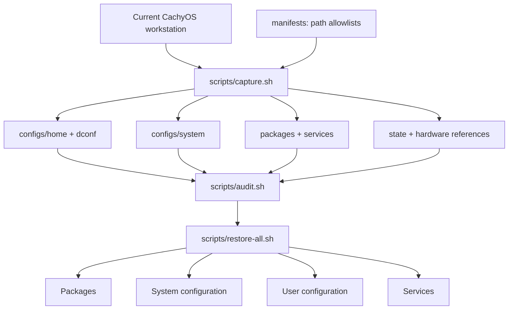

# cachyos-config

[](https://cachyos.org/)


[](README.zh-CN.md)
[](modules/sioyek-ecdict/pyproject.toml)
[](modules/sioyek-ecdict)
[](https://github.com/skywind3000/ECDICT)

**English** · [简体中文](README.zh-CN.md)

An auditable and repeatable recovery kit for a personal CachyOS workstation. It keeps configuration snapshots, package and service manifests, hardware references, and restore automation separate so each layer can be inspected or restored independently.

For a fresh installation, download the CachyOS ISO from the [official download page](https://cachyos.org/download/)—the torrent is recommended—then return here after the base system is installed.


## Architecture



## One-command Sioyek offline dictionary

After installing native Sioyek from the AUR, this clone can add the bundled
offline ECDICT lookup without a separate plugin repository:

```bash
yay -S sioyek-git
git clone https://github.com/Eurekaimer/cachyos-config.git
cd cachyos-config
./scripts/install-sioyek-ecdict.sh
```

Restart Sioyek, select an English word, and press `s`. The first run downloads
and indexes ECDICT; later lookups are local and offline. See the
[Sioyek ECDICT guide](docs/en/sioyek-ecdict.md) for exact changes, Niri
`Super+S`, updating, troubleshooting, and removal.

## Syncing across machines

Git is the transport: capture on the machine you configure, restore on any other machine.

**Publish from the current machine** after any config, package, or service change:

```bash
./scripts/capture.sh     # rebuild the snapshot from the allowlists
./scripts/audit.sh       # refuse to publish if secrets or private paths leaked

git add -A
git commit -m "sync: refresh snapshot"
git push
```

**Apply on another machine** (fresh CachyOS install or any other computer):

```bash
git clone https://github.com/Eurekaimer/cachyos-config.git
cd cachyos-config

./scripts/audit.sh                   # review what the snapshot contains
./scripts/restore-all.sh --dry-run   # preview every replacement and install
./scripts/restore-all.sh             # packages, system, user config, services
sudo reboot
```

The default flow never touches machine-bound state: no disk UUIDs,
`/etc/machine-id`, `/etc/fstab`, or `/etc/hostname` are read or written. The
last two live in a separate hardware layer applied only with an explicit,
reviewed `--with-hardware` on the same disks/host. A different username on the
target machine is fine — absolute home paths in managed files are rewritten
for the current user at restore time.

## Neovim

The managed configuration at `configs/home/.config/nvim` is inspired by
LazyVim, but keeps a small standalone module layout instead of importing the
full distribution:

| Path | Responsibility |
| --- | --- |
| `init.lua` | Sets leader keys and loads the modules in deterministic order |
| `lua/config/` | Editor options, global keymaps, lifecycle hooks, and lazy.nvim bootstrap |
| `lua/plugins/ui.lua` | Tokyo Night, Snacks, which-key, and lualine |
| `lua/plugins/editor.lua` | Treesitter, Git signs, comments, surrounds, and VimBeGood |
| `lua/plugins/lsp.lua` | Mason, LSP servers, completion, snippets, and Lua development support |

Snacks provides the dashboard, explorer, fuzzy picker, notifications, Zen
mode, and LazyGit integration. Mason installs Lua, Go, Rust, Python,
TypeScript/JavaScript, and Bash language servers. Treesitter installs parsers
for the same core language set. The lockfile pins plugin revisions for
repeatable restores.

Common mappings:

| Mapping | Action |
| --- | --- |
| `Space Space` | Smart file search |
| `Space e` | File explorer |
| `Space ff` / `Space fg` | Find files / search project text |
| `Space fb` / `Space bd` | Select / close a buffer |
| `Space gg` | Open LazyGit |
| `gd` / `gr` / `K` | Definition / references / hover documentation |
| `Space ca` / `Space cr` / `Space cf` | Code action / rename / format |
| `Space sk` | Search all configured keymaps |
| `:VimBeGood` | Start the movement practice game |

`neovim`, `ripgrep`, and `lazygit` are captured explicit packages.
`fd`, `npm`, and `tree-sitter-cli` are recovery requirements in
`packages/required-extra.txt`. The nvim directory is allowlisted in
`manifests/home-paths.txt`, so the normal `capture.sh` and `restore-user.sh`
flows include it automatically. Edit the live copy under `~/.config/nvim`,
then run the standard capture and audit workflow before publishing changes.

## Documentation

+ [Configuration map and restore boundaries](docs/en/configuration.md) · [中文](docs/zh-CN/configuration.md)
+ [Capture and snapshot maintenance](docs/en/capture.md) · [中文](docs/zh-CN/capture.md)
+ [Recovery workflow](docs/en/recovery.md) · [中文](docs/zh-CN/recovery.md)
+ [Packages and services](docs/en/packages-services.md) · [中文](docs/zh-CN/packages-services.md)
+ [Niri window manager](docs/en/niri.md) · [中文](docs/zh-CN/niri.md)
+ [Noctalia Shell](docs/en/noctalia.md) · [中文](docs/zh-CN/noctalia.md)
+ [SDDM Qt6 login theme](docs/en/sddm.md) · [中文](docs/zh-CN/sddm.md)
+ [Kitty, shells, and command-line tools](docs/en/kitty-shell.md) · [中文](docs/zh-CN/kitty-shell.md)
+ [MPV media stack](docs/en/mpv.md) · [中文](docs/zh-CN/mpv.md)
+ [Input methods and desktop integration](docs/en/input-desktop.md) · [中文](docs/zh-CN/input-desktop.md)
+ [Sioyek offline ECDICT lookup](docs/en/sioyek-ecdict.md) · [中文](docs/zh-CN/sioyek-ecdict.md)
+ [Security and publishing boundaries](docs/en/security.md) · [中文](docs/zh-CN/security.md)
+ [External storage diagnostics](docs/en/storage-diagnostics.md) · [中文](docs/zh-CN/storage-diagnostics.md)
