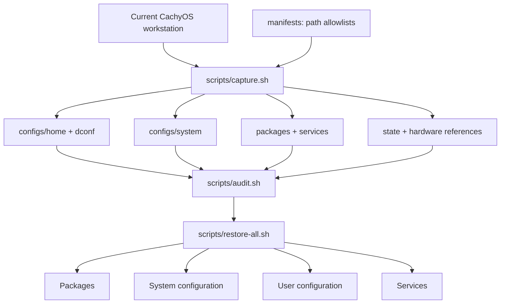

# cachyos-config

[](https://cachyos.org/)


[](README.zh-CN.md)
[](modules/sioyek-ecdict/pyproject.toml)
[](modules/sioyek-ecdict)
[](https://github.com/skywind3000/ECDICT)

**English** · [简体中文](README.zh-CN.md)

Personal CachyOS workstation configuration, kept as a versioned snapshot with
scripts to capture and restore it. Managed files, package and service manifests,
and hardware references are stored separately, so each layer can be inspected
or restored on its own.

For a fresh system, install the base from the
[CachyOS download page](https://cachyos.org/download/) (torrent recommended),
then use this repository to restore the workstation configuration.


## Architecture



## Publishing and restoring

Git is the transport: capture on the machine you configure, restore on any other machine.

**Publish from the current machine** after any config, package, or service change:

```bash
./scripts/capture.sh     # rebuild the snapshot from the allowlists
./scripts/audit.sh       # refuse to publish if secrets or private paths leaked

git add -A
git commit -m "sync: refresh snapshot"
git push
```

Passwordless push setup: [Git authentication](docs/en/git-authentication.md).

**Apply on another machine** (fresh CachyOS install or any other computer):

```bash
git clone https://github.com/Eurekaimer/cachyos-config.git
cd cachyos-config

./scripts/audit.sh                   # review what the snapshot contains
./scripts/restore-all.sh --dry-run   # preview every replacement and install
./scripts/restore-all.sh             # packages, system, user config, services
sudo reboot
```

The default flow never touches machine-bound state: no disk UUIDs,
`/etc/machine-id`, `/etc/fstab`, or `/etc/hostname` are read or written. The
last two live in a separate hardware layer applied only with an explicit,
reviewed `--with-hardware` on the same disks/host. A different username on the
target machine is fine — absolute home paths in managed files are rewritten
for the current user at restore time.

## Documentation

### Configuration and boundaries

+ [Configuration map and restore boundaries](docs/en/configuration.md) · [中文](docs/zh-CN/configuration.md)

### Core workflows

+ [Capture and snapshot maintenance](docs/en/capture.md) · [中文](docs/zh-CN/capture.md)
+ [Recovery workflow](docs/en/recovery.md) · [中文](docs/zh-CN/recovery.md)

### Components

+ [SDDM Qt6 login theme](docs/en/sddm.md) · [中文](docs/zh-CN/sddm.md)
+ [Niri window manager](docs/en/niri.md) · [中文](docs/zh-CN/niri.md)
+ [Noctalia Shell](docs/en/noctalia.md) · [中文](docs/zh-CN/noctalia.md)
+ [Input methods and desktop integration](docs/en/input-desktop.md) · [中文](docs/zh-CN/input-desktop.md)
+ [Kitty, shells, and command-line tools](docs/en/kitty-shell.md) · [中文](docs/zh-CN/kitty-shell.md)
+ [Neovim editor](docs/en/neovim.md) · [中文](docs/zh-CN/neovim.md)
+ [Yazi file manager](docs/en/yazi.md) · [中文](docs/zh-CN/yazi.md)
+ [MPV media stack](docs/en/mpv.md) · [中文](docs/zh-CN/mpv.md)
+ [KOReader ebook reader](docs/en/koreader.md) · [中文](docs/zh-CN/koreader.md)
+ [Sioyek offline ECDICT lookup](docs/en/sioyek-ecdict.md) · [中文](docs/zh-CN/sioyek-ecdict.md)
+ [Java toolchain: dual OpenJDK + Maven](docs/en/jdk.md) · [中文](docs/zh-CN/jdk.md)
+ [TeX Live](docs/en/texlive.md) · [中文](docs/zh-CN/texlive.md)

### Packages and services

+ [Packages and services](docs/en/packages-services.md) · [中文](docs/zh-CN/packages-services.md)

### Security and publishing

+ [Security and publishing boundaries](docs/en/security.md) · [中文](docs/zh-CN/security.md)

### Diagnostics and optional scripts

+ [External storage diagnostics](docs/en/storage-diagnostics.md) · [中文](docs/zh-CN/storage-diagnostics.md)
+ [Optional user scripts](docs/en/user-scripts.md) · [中文](docs/zh-CN/user-scripts.md)
