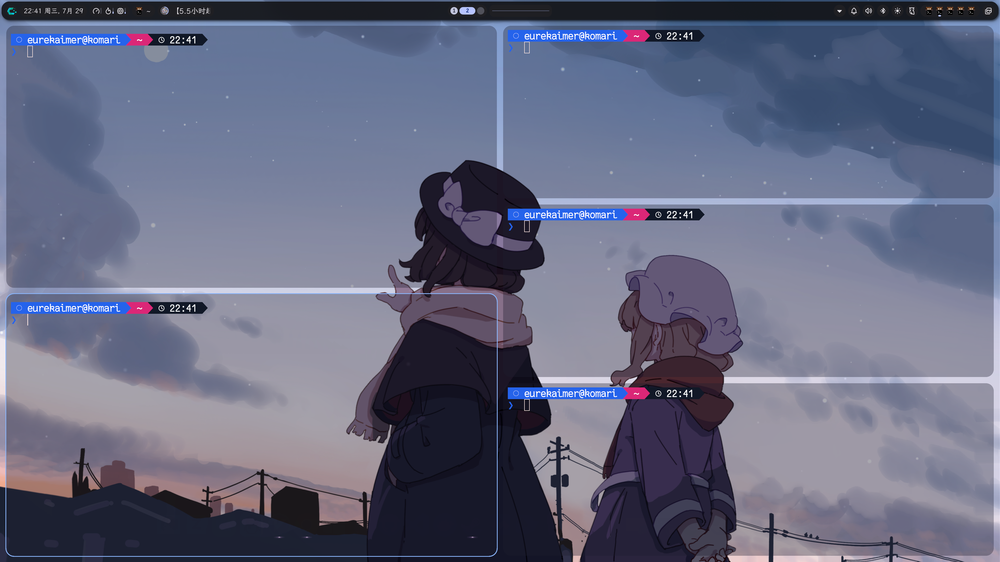
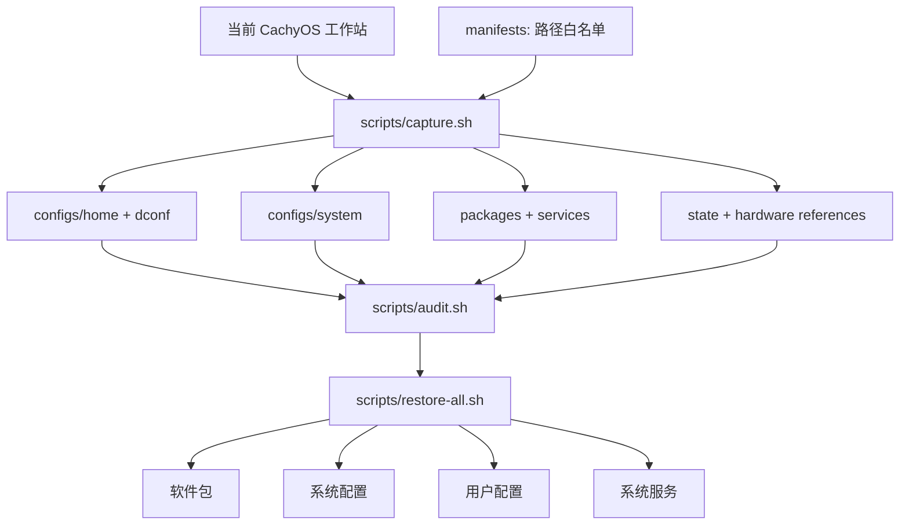

# cachyos-config

[](https://cachyos.org/)


[](README.md)
[](modules/sioyek-ecdict/pyproject.toml)
[](modules/sioyek-ecdict)
[](https://github.com/skywind3000/ECDICT)

[English](README.md) · **简体中文**

个人 CachyOS 工作站的配置快照与恢复脚本。托管文件、软件与服务清单、硬件参考
信息彼此分离，每一层都可以独立检查或单独恢复。

全新系统请先按 [CachyOS 官方下载页](https://cachyos.org/download/) 安装基础
系统（建议使用种子下载），再用本仓库恢复工作站配置。



## 架构



## 发布与恢复

Git 就是传输介质：在配置好的机器上采集，在任意其他机器上恢复。

**在当前机器上发布**（配置、软件包或服务有任何改动后）：

```bash
./scripts/capture.sh     # 按 manifests 白名单重建快照
./scripts/audit.sh       # 有密钥或隐私路径泄漏则拒绝发布

git add -A
git commit -m "sync: refresh snapshot"
git push
```

免密推送配置见 [Git 免密推送（GitHub）](docs/zh-CN/git-authentication.md)。

**在另一台机器上应用**（全新 CachyOS 安装或其他电脑）：

```bash
git clone https://github.com/Eurekaimer/cachyos-config.git
cd cachyos-config

./scripts/audit.sh                   # 先检查快照内容
./scripts/restore-all.sh --dry-run   # 预览所有替换与安装操作
./scripts/restore-all.sh             # 软件包、系统、用户配置、服务
sudo reboot
```

默认流程不涉及任何机器专属状态：不会读写磁盘 UUID、`/etc/machine-id`、
`/etc/fstab` 或 `/etc/hostname`。后两者位于单独的 hardware 层，只有确认磁盘
布局一致并显式使用 `--with-hardware` 评审后才会应用。目标机器用户名不同也没
关系——托管文件中的绝对 home 路径会在恢复时自动改写为当前用户。

## 文档

### 配置地图与边界

+ [配置位置与恢复边界](docs/zh-CN/configuration.md) · [English](docs/en/configuration.md)

### 核心流程

+ [采集与快照维护](docs/zh-CN/capture.md) · [English](docs/en/capture.md)
+ [恢复流程](docs/zh-CN/recovery.md) · [English](docs/en/recovery.md)

### 组件

+ [SDDM Qt6 登录主题](docs/zh-CN/sddm.md) · [English](docs/en/sddm.md)
+ [Niri 窗口管理器](docs/zh-CN/niri.md) · [English](docs/en/niri.md)
+ [Noctalia Shell](docs/zh-CN/noctalia.md) · [English](docs/en/noctalia.md)
+ [输入法与桌面集成](docs/zh-CN/input-desktop.md) · [English](docs/en/input-desktop.md)
+ [Kitty、Shell 与命令行工具](docs/zh-CN/kitty-shell.md) · [English](docs/en/kitty-shell.md)
+ [Neovim 编辑器](docs/zh-CN/neovim.md) · [English](docs/en/neovim.md)
+ [Yazi 文件管理器](docs/zh-CN/yazi.md) · [English](docs/en/yazi.md)
+ [MPV 媒体栈](docs/zh-CN/mpv.md) · [English](docs/en/mpv.md)
+ [KOReader 阅读器](docs/zh-CN/koreader.md) · [English](docs/en/koreader.md)
+ [Sioyek 离线 ECDICT 查词](docs/zh-CN/sioyek-ecdict.md) · [English](docs/en/sioyek-ecdict.md)
+ [Java 工具链：双版本 OpenJDK 与 Maven](docs/zh-CN/jdk.md) · [English](docs/en/jdk.md)
+ [TeX Live](docs/zh-CN/texlive.md) · [English](docs/en/texlive.md)

### 软件包与服务

+ [软件包与服务](docs/zh-CN/packages-services.md) · [English](docs/en/packages-services.md)

### 安全与发布

+ [安全与公开边界](docs/zh-CN/security.md) · [English](docs/en/security.md)

### 诊断与可选脚本

+ [外置存储诊断](docs/zh-CN/storage-diagnostics.md) · [English](docs/en/storage-diagnostics.md)
+ [可选用户脚本](docs/zh-CN/user-scripts.md) · [English](docs/en/user-scripts.md)
