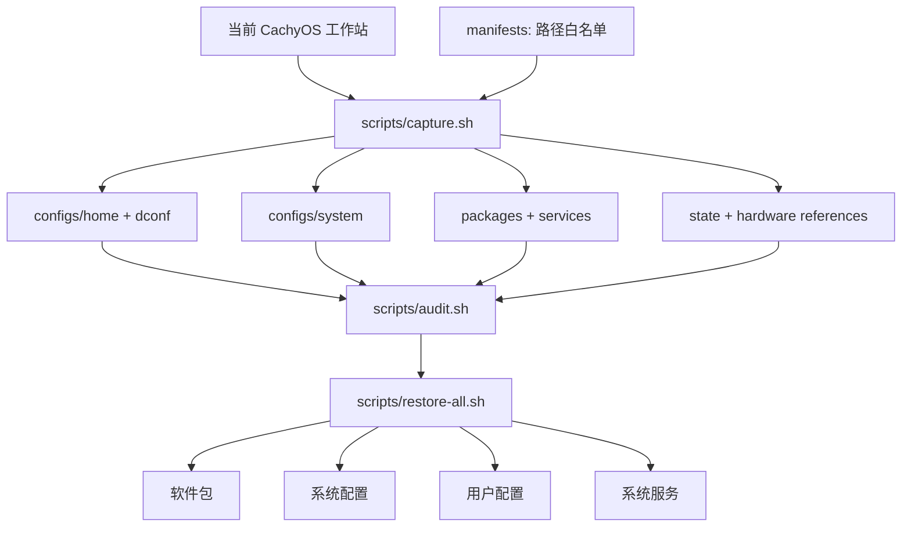

# cachyos-config

[](https://cachyos.org/)


[](README.md)
[](modules/sioyek-ecdict/pyproject.toml)
[](modules/sioyek-ecdict)
[](https://github.com/skywind3000/ECDICT)

[English](README.md) · **简体中文**

这是一个面向个人 CachyOS 工作站、可审计且可重复执行的恢复包。配置快照、软件与服务清单、硬件参考信息和恢复脚本彼此分离，因此可以独立检查或恢复每一层。

全新安装时，请从 [CachyOS 官方下载页](https://cachyos.org/download/)获取 ISO，建议使用种子（torrent）下载；完成基础系统安装后再使用本仓库恢复配置。

[](system.png)

## 架构



## 一条命令安装 Sioyek 离线词典

通过 AUR 安装原生 Sioyek 后，只需克隆本仓库即可应用内置 ECDICT 插件，
不需要再寻找单独的插件仓库：

```bash
yay -S sioyek-git
git clone https://github.com/Eurekaimer/cachyos-config.git
cd cachyos-config
./scripts/install-sioyek-ecdict.sh
```

重启 Sioyek，选中英文并按 `s` 即可查词。首次安装会下载并索引 ECDICT，
之后均为本地离线查询。完整的改动范围、Niri `Super+S`、更新、排障和卸载方法
见 [Sioyek ECDICT 插件说明](docs/zh-CN/sioyek-ecdict.md)。

## 可选个人脚本

与机器绑定的辅助脚本（校园网登录、ANI-RSS 容器栈、komari-call 终端聊天）
不进通用快照恢复，因为不是每台机器都需要。按需单独安装：

```bash
./scripts/install-campus-login.sh     # 校园网认证页，直连模式
./scripts/install-docker-anirss.sh    # ANI-RSS + qBittorrent 容器栈助手
./scripts/install-komari-call.sh      # 终端聊天程序，从 GitHub 构建
```

详见[可选用户脚本说明](docs/zh-CN/user-scripts.md) · [English](docs/en/user-scripts.md)。

## 跨机器同步

Git 就是传输介质：在配置好的机器上采集，在任意其他机器上恢复。

**在当前机器上发布**（配置、软件包或服务有任何改动后）：

```bash
./scripts/capture.sh     # 按 manifests 白名单重建快照
./scripts/audit.sh       # 有密钥或隐私路径泄漏则拒绝发布

git add -A
git commit -m "sync: refresh snapshot"
git push
```

**在另一台机器上应用**（全新 CachyOS 安装或其他电脑）：

```bash
git clone https://github.com/Eurekaimer/cachyos-config.git
cd cachyos-config

./scripts/audit.sh                   # 先检查快照内容
./scripts/restore-all.sh --dry-run   # 预览所有替换与安装操作
./scripts/restore-all.sh             # 软件包、系统、用户配置、服务
sudo reboot
```

默认流程不涉及任何机器专属状态：不会读写磁盘 UUID、`/etc/machine-id`、
`/etc/fstab` 或 `/etc/hostname`。后两者位于单独的 hardware 层，只有确认磁盘
布局一致并显式使用 `--with-hardware` 评审后才会应用。目标机器用户名不同也没
关系——托管文件中的绝对 home 路径会在恢复时自动改写为当前用户。

## Neovim

仓库中的 Neovim 配置参考 LazyVim，但有意只保留九个插件仓库。通用 UI 统一由
Snacks 负责，补全、注释、代码片段、状态栏和配色优先使用 Neovim 0.12 内置能力。
完整的结构、每个插件的 GitHub 地址与保留理由、未采用的替代品、快捷键、
LSP/Treesitter、恢复、维护和排障说明见
[Neovim 完整指南](docs/zh-CN/neovim.md) · [English](docs/en/neovim.md)。

## 文档

### 配置地图与恢复边界

+ [配置位置与恢复边界](docs/zh-CN/configuration.md) · [English](docs/en/configuration.md)

### 功能与工作流指南

以下按照英文标题字母序排列，保证中英文索引顺序一致。

+ [采集与快照维护](docs/zh-CN/capture.md) · [English](docs/en/capture.md)
+ [外置存储诊断](docs/zh-CN/storage-diagnostics.md) · [English](docs/en/storage-diagnostics.md)
+ [输入法与桌面集成](docs/zh-CN/input-desktop.md) · [English](docs/en/input-desktop.md)
+ [Kitty、Shell 与命令行工具](docs/zh-CN/kitty-shell.md) · [English](docs/en/kitty-shell.md)
+ [MPV 媒体栈](docs/zh-CN/mpv.md) · [English](docs/en/mpv.md)
+ [Neovim 编辑器](docs/zh-CN/neovim.md) · [English](docs/en/neovim.md)
+ [Niri 窗口管理器](docs/zh-CN/niri.md) · [English](docs/en/niri.md)
+ [Noctalia Shell](docs/zh-CN/noctalia.md) · [English](docs/en/noctalia.md)
+ [软件包与服务](docs/zh-CN/packages-services.md) · [English](docs/en/packages-services.md)
+ [恢复流程](docs/zh-CN/recovery.md) · [English](docs/en/recovery.md)
+ [SDDM Qt6 登录主题](docs/zh-CN/sddm.md) · [English](docs/en/sddm.md)
+ [安全与公开边界](docs/zh-CN/security.md) · [English](docs/en/security.md)
+ [Sioyek 离线 ECDICT 查词](docs/zh-CN/sioyek-ecdict.md) · [English](docs/en/sioyek-ecdict.md)
+ [可选用户脚本](docs/zh-CN/user-scripts.md) · [English](docs/en/user-scripts.md)
