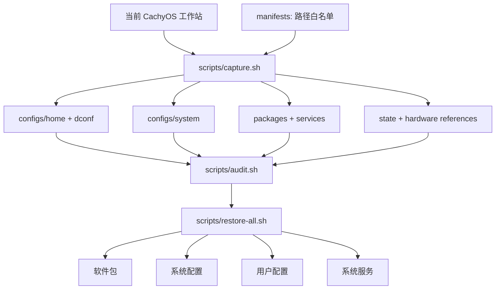

# cachyos-config

[](https://cachyos.org/)


[](README.md)
[](modules/sioyek-ecdict/pyproject.toml)
[](modules/sioyek-ecdict)
[](https://github.com/skywind3000/ECDICT)

[English](README.md) · **简体中文**

这是一个面向个人 CachyOS 工作站、可审计且可重复执行的恢复包。配置快照、软件与服务清单、硬件参考信息和恢复脚本彼此分离，因此可以独立检查或恢复每一层。

全新安装时，请从 [CachyOS 官方下载页](https://cachyos.org/download/)获取 ISO，建议使用种子（torrent）下载；完成基础系统安装后再使用本仓库恢复配置。

[](system.png)

## 架构



## 一条命令安装 Sioyek 离线词典

通过 AUR 安装原生 Sioyek 后，只需克隆本仓库即可应用内置 ECDICT 插件，
不需要再寻找单独的插件仓库：

```bash
yay -S sioyek-git
git clone https://github.com/Eurekaimer/cachyos-config.git
cd cachyos-config
./scripts/install-sioyek-ecdict.sh
```

重启 Sioyek，选中英文并按 `s` 即可查词。首次安装会下载并索引 ECDICT，
之后均为本地离线查询。完整的改动范围、Niri `Super+S`、更新、排障和卸载方法
见 [Sioyek ECDICT 插件说明](docs/zh-CN/sioyek-ecdict.md)。

## 跨机器同步

Git 就是传输介质：在配置好的机器上采集，在任意其他机器上恢复。

**在当前机器上发布**（配置、软件包或服务有任何改动后）：

```bash
./scripts/capture.sh     # 按 manifests 白名单重建快照
./scripts/audit.sh       # 有密钥或隐私路径泄漏则拒绝发布

git add -A
git commit -m "sync: refresh snapshot"
git push
```

**在另一台机器上应用**（全新 CachyOS 安装或其他电脑）：

```bash
git clone https://github.com/Eurekaimer/cachyos-config.git
cd cachyos-config

./scripts/audit.sh                   # 先检查快照内容
./scripts/restore-all.sh --dry-run   # 预览所有替换与安装操作
./scripts/restore-all.sh             # 软件包、系统、用户配置、服务
sudo reboot
```

默认流程不涉及任何机器专属状态：不会读写磁盘 UUID、`/etc/machine-id`、
`/etc/fstab` 或 `/etc/hostname`。后两者位于单独的 hardware 层，只有确认磁盘
布局一致并显式使用 `--with-hardware` 评审后才会应用。目标机器用户名不同也没
关系——托管文件中的绝对 home 路径会在恢复时自动改写为当前用户。

## Neovim

仓库通过 `configs/home/.config/nvim` 管理 Neovim。整体体验参考 LazyVim，
但没有直接导入完整发行版，而是保持少量、职责明确的模块：

| 路径 | 职责 |
| --- | --- |
| `init.lua` | 设置 leader 键，并按固定顺序加载模块 |
| `lua/config/` | 编辑器选项、全局快捷键、生命周期钩子和 lazy.nvim 引导 |
| `lua/plugins/ui.lua` | Tokyo Night、Snacks、which-key 和 lualine |
| `lua/plugins/editor.lua` | Treesitter、Git 标记、注释、成对符号和 VimBeGood |
| `lua/plugins/lsp.lua` | Mason、LSP、自动补全、代码片段和 Lua 配置开发支持 |

Snacks 提供启动页、文件树、模糊搜索、通知、专注模式和 LazyGit 集成。
Mason 自动安装 Lua、Go、Rust、Python、TypeScript/JavaScript 和 Bash
语言服务器；Treesitter 安装对应的常用语言解析器。`lazy-lock.json`
固定插件版本，保证不同机器恢复结果一致。

常用快捷键：

| 快捷键 | 功能 |
| --- | --- |
| `Space Space` | 智能查找文件 |
| `Space e` | 打开文件树 |
| `Space ff` / `Space fg` | 查找文件 / 全文搜索 |
| `Space fb` / `Space bd` | 选择 / 关闭文件 |
| `Space gg` | 打开 LazyGit |
| `gd` / `gr` / `K` | 跳转定义 / 查看引用 / 悬停文档 |
| `Space ca` / `Space cr` / `Space cf` | 代码操作 / 重命名 / 格式化 |
| `Space sk` | 搜索全部已配置快捷键 |
| `:VimBeGood` | 启动 Vim 移动练习 |

`neovim`、`ripgrep` 和 `lazygit` 已位于显式软件包快照；
`fd`、`npm` 和 `tree-sitter-cli` 位于 `packages/required-extra.txt`。
`manifests/home-paths.txt` 已将 nvim 目录加入白名单，因此常规
`capture.sh` 与 `restore-user.sh` 会自动采集和恢复。日常修改
`~/.config/nvim` 后，按上文的采集、审计和发布流程同步即可。

## 文档

+ [配置位置与恢复边界](docs/zh-CN/configuration.md) · [English](docs/en/configuration.md)
+ [采集与快照维护](docs/zh-CN/capture.md) · [English](docs/en/capture.md)
+ [恢复流程](docs/zh-CN/recovery.md) · [English](docs/en/recovery.md)
+ [软件包与服务](docs/zh-CN/packages-services.md) · [English](docs/en/packages-services.md)
+ [Niri 窗口管理器](docs/zh-CN/niri.md) · [English](docs/en/niri.md)
+ [Noctalia Shell](docs/zh-CN/noctalia.md) · [English](docs/en/noctalia.md)
+ [SDDM Qt6 登录主题](docs/zh-CN/sddm.md) · [English](docs/en/sddm.md)
+ [Kitty、Shell 与命令行工具](docs/zh-CN/kitty-shell.md) · [English](docs/en/kitty-shell.md)
+ [MPV 媒体栈](docs/zh-CN/mpv.md) · [English](docs/en/mpv.md)
+ [输入法与桌面集成](docs/zh-CN/input-desktop.md) · [English](docs/en/input-desktop.md)
+ [Sioyek 离线 ECDICT 查词](docs/zh-CN/sioyek-ecdict.md) · [English](docs/en/sioyek-ecdict.md)
+ [安全与公开边界](docs/zh-CN/security.md) · [English](docs/en/security.md)
+ [外置存储诊断](docs/zh-CN/storage-diagnostics.md) · [English](docs/en/storage-diagnostics.md)
