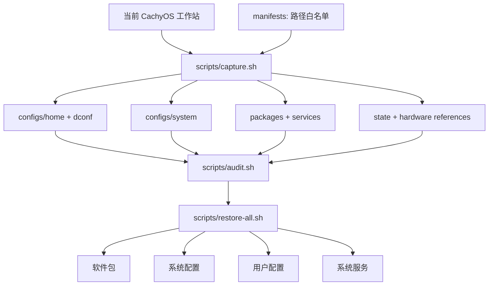

# cachyos-config

[English](README.md) · **简体中文**

这是一个面向个人 CachyOS 工作站、可审计且可重复执行的恢复包。配置快照、软件与服务清单、硬件参考信息和恢复脚本彼此分离，因此可以独立检查或恢复每一层。

全新安装时，请从 [CachyOS 官方下载页](https://cachyos.org/download/)获取 ISO，建议使用种子（torrent）下载；完成基础系统安装后再使用本仓库恢复配置。

## 架构

## 文档

+ [配置位置与恢复边界](docs/zh-CN/configuration.md) · [English](docs/en/configuration.md)
+ [采集与快照维护](docs/zh-CN/capture.md) · [English](docs/en/capture.md)
+ [恢复流程](docs/zh-CN/recovery.md) · [English](docs/en/recovery.md)
+ [软件包与服务](docs/zh-CN/packages-services.md) · [English](docs/en/packages-services.md)
+ [Niri 窗口管理器](docs/zh-CN/niri.md) · [English](docs/en/niri.md)
+ [Noctalia Shell](docs/zh-CN/noctalia.md) · [English](docs/en/noctalia.md)
+ [Kitty、Shell 与命令行工具](docs/zh-CN/kitty-shell.md) · [English](docs/en/kitty-shell.md)
+ [MPV 媒体栈](docs/zh-CN/mpv.md) · [English](docs/en/mpv.md)
+ [输入法与桌面集成](docs/zh-CN/input-desktop.md) · [English](docs/en/input-desktop.md)
+ [安全与公开边界](docs/zh-CN/security.md) · [English](docs/en/security.md)
+ [外置存储诊断](docs/zh-CN/storage-diagnostics.md) · [English](docs/en/storage-diagnostics.md)
