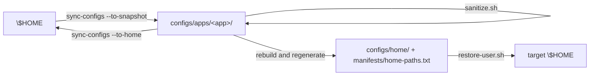
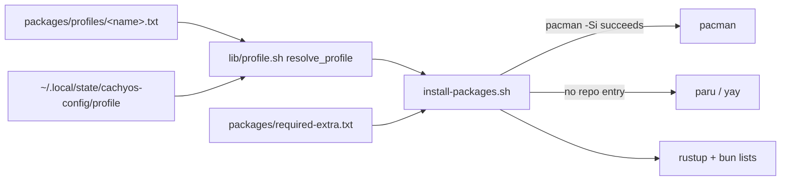
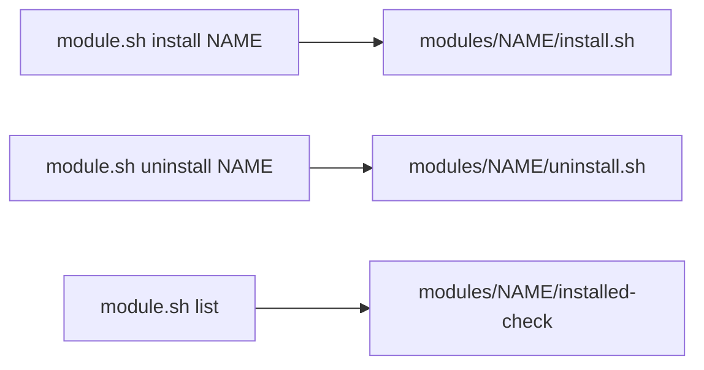

# ARCHITECTURE

How the repository is layered, how data flows between layers, and what each
script is allowed to do. Read `MEMORY.md` for invariants and per-app notes.

## Directory tree

```
packages/
  profiles/full.txt            # install input: current workstation
  profiles/minimal.txt         # install input: ThinkPad T480 class
  required-extra.txt           # install input: recovery-tool dependencies
  inventory/                   # capture output: pacman -Qqen / -Qqm
  services/{system,user}.txt   # capture output: enabled units
  toolchains/{rustup,bun}.txt  # capture output: toolchains and global tools
manifests/
  home-paths.txt               # GENERATED from configs/apps/*/paths
  system-{portable,hardware,reference}-paths.txt
configs/
  apps/<app>/paths             # the $HOME paths that app owns
  apps/<app>/…                 # that app's configuration (source of truth)
  home/…                       # GENERATED $HOME install tree
  dconf/user.ini               # desktop settings text export
  system/{portable,hardware,reference}/
modules/<name>/                # install.sh, uninstall.sh, README.md,
                               # installed-check, payload files
scripts/
  module.sh                    # module entry point
  profile.sh                   # profile entry point
  capture.sh                   # machine -> repository
  sync-configs.sh              # configs/apps <-> $HOME, configs/home
  restore-{all,system,user,services}.sh
  install-{packages,progress}.sh
  sync-{sddm-theme,timewarrior}.sh, post-restore-tweaks.sh, migrate-home-dirs-zh.sh
  audit.sh
  lib/{common,restore,profile,sanitize,proxy}.sh
docs/
  en/, zh-CN/                  # user documentation, bilingual
  agents/{MEMORY,ARCHITECTURE,TASKS,JOURNAL}.md
state/                         # captured machine metadata and hardware reference
```

## Data flow

### Configuration



`configs/apps/` is the only authored copy. `configs/home/` and
`manifests/home-paths.txt` are derived and are rewritten together inside one
transaction, so a failure leaves the previous published state intact.

### Packages



AUR membership is inferred from the profile itself; `packages/inventory/` is
never read by the installer.

### Modules



## Module contract

A conforming module directory contains:

| File | Required | Purpose |
|---|---|---|
| `install.sh` | yes | Idempotent install; accepts `--dry-run` and `--help` |
| `uninstall.sh` | yes | Reverse install |
| `README.md` | yes | What it does, install, verify, remove |
| `installed-check` | recommended | Absolute paths (may use `$HOME`), one per line, all of which exist after a successful install |
| payload files | as needed | Scripts, units, plugin sources, submodules |

`scripts/module.sh` is the only entry point: it validates the module, refuses to
run as root, forwards module-specific flags that follow the module name, and
reports installed state from `installed-check`. A directory under `modules/`
without `install.sh` (currently `modules/sddm`, consumed by
`scripts/sync-sddm-theme.sh`) is reported and skipped; see `TASKS.md`.

## Script naming rules

| Pattern | Meaning |
|---|---|
| `capture*` | machine → repository; never touches the machine's configuration |
| `sync-*` | keeps one artifact pair in step; declare the direction explicitly |
| `restore-*` | repository → machine |
| `install-*` | installs packages or toolchains |
| `module.sh`, `profile.sh` | entry points that dispatch to the units above |
| `audit.sh` | read-only validation; must fail loudly rather than warn |

## Restore order

`scripts/restore-all.sh` runs the stages in this order, and the order matters:

0. preflight (`ensure_sudo`, submodule init, optional zh-directory migration)
1. packages and toolchains
2. system configuration (`/etc`, portable layer)
3. user configuration and dconf (`configs/home/`)
4. SDDM theme (needs the submodule from stage 0)
5. service enablement
6. post-restore tweaks (noctalia runtime backfill, eDP-1 scaling, wallpaper)

Stage 3 replaces whole paths, so anything machine-specific that lives inside a
managed path is re-applied in stage 6 from the backup taken in stage 3.
