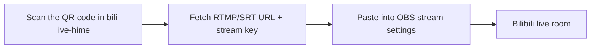

# Bilibili streaming: bili-live-hime + OBS

[简体中文](../zh-CN/bili-live-hime.md)

Going live takes two steps: fetch the ingest URL and stream key from Bilibili with
the lightweight `bili-live-hime` client, then push those credentials through OBS.
The official streaming app is not required.



## bili-live-hime (optional install)

Upstream: [Rsplwe/bili-live-hime](https://github.com/Rsplwe/bili-live-hime) (MIT).
It fetches the ingest URL and stream key, edits the room title and category, sends
and receives danmaku, manages moderators and blocked words, and shows viewer
statistics.

It stays out of the generic snapshot restore: the project sources and build output
live outside the `$HOME` allowlists, and every rebuild depends on the local
toolchain. Install it with its own script:

```bash
./scripts/install-bili-live-hime.sh
./scripts/install-bili-live-hime.sh --dry-run   # preview only
```

The installer only fills gaps: it clones the upstream project with
`git clone --depth 1` when the directory is missing, runs `npm install` when
`node_modules` is missing, builds with `npm run tauri build -- --no-bundle` when
no release binary exists (a few minutes the first time), and finally installs the
launcher into `~/.local/bin/bili-live-hime`.

| Action | Command |
| --- | --- |
| Launch (reuse existing build) | `bili-live-hime` |
| Rebuild, then launch | `bili-live-hime --rebuild` |
| Use another project directory | `BILI_LIVE_HIME_DIR=/path/to/project bili-live-hime` |

The launcher prefers `src-tauri/target/release/bili-live-hime` and builds once
when the artifact is missing. If `src/`, `src-tauri/src/`, or `package.json` is
newer than the artifact it only suggests `--rebuild`; it never rebuilds on its
own. Requirements: Node.js 20+, a Rust toolchain, and `webkit2gtk-4.1`,
`libsoup3`, `gtk3`, `librsvg`.

Remove the launcher with `modules/bili-live-hime/uninstall.sh`; the project
directory and build output stay in place.

## OBS Studio

`obs-studio` (currently 32.2.2) is an explicit package in
`packages/pacman-explicit.txt`, and its configuration is part of the managed
snapshot:

| Snapshot content | Purpose |
| --- | --- |
| `configs/home/.config/obs-studio/global.ini`, `user.ini` | Interface and general settings |
| `basic/scenes/` | Scene collections |
| `basic/profiles/` | Encoder and stream settings (no `service.json`) |
| `plugin_manager/modules.json` | Plugin inventory |

`basic/profiles/*/service.json` holds the stream key, so `scripts/capture.sh`
deletes it (and its `.bak`) before publishing; `logs/`, `profiler_data/`, and
`plugin_config/` are not allowlisted at all. A restore therefore keeps scenes and
encoder settings but needs the ingest URL and stream key re-entered — fetch them
again from bili-live-hime.

## Credential boundary

bili-live-hime stores its login state and ingest credentials in
`~/.config/com.rsplwe.bili-live-hime/app-config.json`: the `SESSDATA`,
`bili_jct`, and `DedeUserID` cookies plus the stream key. That path is not in
`manifests/home-paths.txt`, and `scripts/audit.sh` lists
`com.rsplwe.bili-live-hime` as a forbidden path, so the snapshot is rejected if it
ever leaks into `configs/`. After moving machines, scan the QR code again; the
stream key is reissued by Bilibili for the room.
