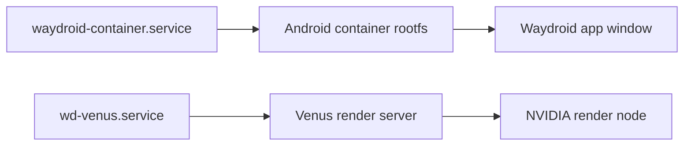

# Waydroid (Android container, NVIDIA/Venus variant)

[简体中文](../zh-CN/waydroid.md)

This workstation runs an Android container on Wayland through
`waydroid-nvidia-bin`, wired to the NVIDIA GPU: the package ships the
Venus/Virtio-GPU guest drivers and a patched surfaceflinger, `wd-venus.service`
(a user unit) runs the virgl render server, and a udev rule grants `uaccess` on
`/dev/udmabuf`.



## Relationship to the snapshot

| Item | Location | Restore behavior |
| --- | --- | --- |
| Package | `waydroid-nvidia-bin` | Listed in `packages/aur-explicit.txt`; `install-packages.sh` installs it |
| System service | `waydroid-container.service` | Listed in `packages/system-services.txt`; `restore-services.sh` re-enables it |
| User service | `wd-venus.service` | Listed in `packages/user-services.txt`; same restore path |
| UFW rules | DHCP/DNS and forwarding rules for `waydroid0` | Restored with `configs/system/portable/etc/ufw/` |
| Container data | `/var/lib/waydroid/` (rootfs, images, `waydroid.cfg`, `waydroid.prop`, `nv/`; ~2.5 GB) | Not allowlisted — machine-local; re-initialize after a restore |

No kernel configuration is needed: the CachyOS kernel has
`CONFIG_ANDROID_BINDER_IPC` and `CONFIG_ANDROID_BINDERFS` built in, and
`/etc/modules-load.d/` contains no related entry.

## Daily use

| Action | Command |
| --- | --- |
| Check status | `waydroid status` |
| Start the session | `waydroid session start` |
| Show the full UI | `waydroid show-full-ui` |
| Launch one app | `waydroid app launch <package>` |
| Stop the session | `waydroid session stop` |

`Vendor type` in `waydroid status` names the image source (`MAINLINE` here), and
the desktop launcher entry is called `Waydroid`.

## Re-initialize after a restore

The container data is not snapshotted, so on a new machine (or after a
reinstall) run these in order:

```bash
sudo waydroid init                      # downloads and initializes the Android image (several GB; proxy needed on restricted networks)
sudo waydroid-nvidia-setup --refresh 144  # configures the NVIDIA/Venus stack for your monitor's refresh rate
```

`waydroid-nvidia-setup` must run after `waydroid init` and is safe to re-run;
repeat it after changing the monitor refresh rate or updating the kernel. Above
240 Hz it enables the vsync-snap path in the package's patched surfaceflinger,
which lower refresh rates do not need.
