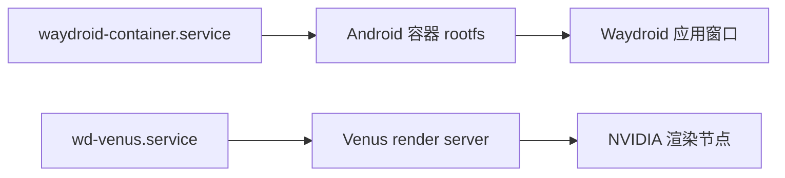

# Waydroid（Android 容器，NVIDIA/Venus 变体）

[English](../en/waydroid.md)

本机用 `waydroid-nvidia-bin` 在 Wayland 下跑 Android 容器，并把它接到 NVIDIA
GPU：包内自带 Venus/Virtio-GPU 访客驱动和补丁版 surfaceflinger，
`wd-venus.service`（用户级）运行 virgl render server，udev 规则给
`/dev/udmabuf` 加 `uaccess`。



## 与快照的关系

| 内容 | 位置 | 恢复行为 |
| --- | --- | --- |
| 软件包 | `waydroid-nvidia-bin` | 在 `packages/aur-explicit.txt` 中，`install-packages.sh` 安装 |
| 系统服务 | `waydroid-container.service` | 在 `packages/system-services.txt` 中，`restore-services.sh` 恢复启用 |
| 用户服务 | `wd-venus.service` | 在 `packages/user-services.txt` 中，同上 |
| UFW 规则 | `waydroid0` 的 DHCP/DNS 与转发规则 | 随 `configs/system/portable/etc/ufw/` 恢复 |
| 容器数据 | `/var/lib/waydroid/`（rootfs、镜像、`waydroid.cfg`、`waydroid.prop`、`nv/`，约 2.5 GB） | 不在白名单，属机器本地数据；恢复后需要重新初始化 |

内核无需额外配置：CachyOS 内核内建 `CONFIG_ANDROID_BINDER_IPC` 与
`CONFIG_ANDROID_BINDERFS`，`/etc/modules-load.d/` 里没有相关条目。

## 日常操作

| 操作 | 命令 |
| --- | --- |
| 查看状态 | `waydroid status` |
| 启动会话 | `waydroid session start` |
| 显示完整界面 | `waydroid show-full-ui` |
| 启动单个应用 | `waydroid app launch <package>` |
| 停止会话 | `waydroid session stop` |

`waydroid status` 的 `Vendor type` 表示镜像来源（本机为 `MAINLINE`）；桌面启动器
条目名为 `Waydroid`。

## 恢复后重新初始化

容器数据不入快照，因此换机器或重装后按顺序执行：

```bash
sudo waydroid init                      # 下载并初始化 Android 镜像（数 GB，网络受限时需代理）
sudo waydroid-nvidia-setup --refresh 144  # 按显示器刷新率配置 NVIDIA/Venus 栈
```

`waydroid-nvidia-setup` 必须在 `waydroid init` 之后运行，脚本可重复执行；调整显示器
刷新率或内核更新后重跑即可。刷新率高于 240 Hz 时会启用包内补丁版 surfaceflinger 的
vsync-snap 路径，普通刷新率不需要。
